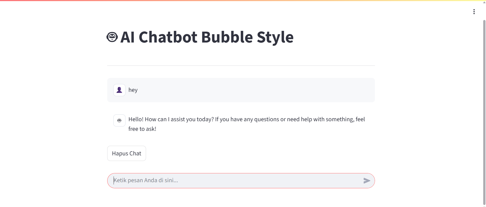

# fun_project_2_REA6NSAKZ
AI Chatbot Bubble Style with Streamlit and OpenRouter API



## Deskripsi Proyek

Proyek ini adalah implementasi aplikasi chatbot AI bergaya "bubble chat" yang interaktif, dibangun menggunakan framework Streamlit untuk antarmuka pengguna dan terintegrasi dengan OpenRouter API untuk memproses permintaan dan mendapatkan respons dari berbagai model bahasa besar (Large Language Models - LLMs).

Pengguna dapat mengetik pesan dan menerima respons real-time dari AI, dengan riwayat percakapan yang tersimpan dan ditampilkan dalam format gelembung chat yang familiar.

## Fitur Utama

* **Tampilan Chat Bubble:** Antarmuka pengguna yang intuitif dengan pesan pengguna dan AI yang ditampilkan dalam gelembung gaya aplikasi chat populer.
* **Integrasi OpenRouter API:** Menggunakan OpenRouter sebagai gateway untuk mengakses berbagai model AI, memastikan fleksibilitas dan akses ke model canggih (misalnya, Mistral, Gemma, Mixtral).
* **Riwayat Chat Persisten:** Percakapan sebelumnya disimpan dan ditampilkan menggunakan Streamlit Session State, menciptakan pengalaman chat yang berkelanjutan.
* **Respons Dinamis:** AI merespons pesan pengguna secara real-time.
* **Penanganan Error:** Menampilkan pesan yang informatif jika terjadi masalah saat berkomunikasi dengan API.
* **Hapus Riwayat Chat:** Tombol untuk membersihkan semua percakapan sebelumnya.

## Teknologi yang Digunakan

* **Python:** Bahasa pemrograman utama.
* **Streamlit:** Framework Python untuk membangun aplikasi web data dengan cepat.
* **Requests:** Library HTTP untuk melakukan panggilan ke OpenRouter API.
* **OpenRouter API:** Layanan yang menyediakan akses terpadu ke berbagai model LLM.

## Persyaratan Sistem

* Python 3.7+
* Koneksi internet untuk mengakses OpenRouter API.

## Cara Mengatur Proyek (Setup)

Ikuti langkah-langkah di bawah ini untuk menjalankan proyek secara lokal di komputer Anda.

### 1. Clone Repositori

Buka Terminal atau Command Prompt dan jalankan perintah berikut:

```bash
git clone [https://github.com/rarazhafira3/fun_project_2_REA6NSAKZ.git](https://github.com/rarazhafira3/fun_project_2_REA6NSAKZ.git)
cd fun_project_2_REA6NSAKZ
